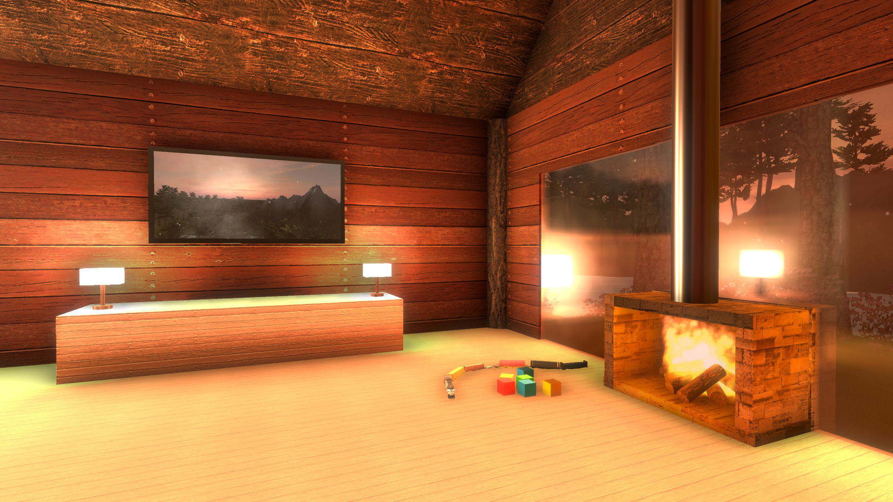

# Snowy Cabin (Demo)

*Snowy Cabin is demo game created in Unity and is not a "real" game, however it is playable and interactive.*

## Project Background

This project was my first real attempt at creating an interactive world using Unity. The assignment was completed during my second semester of University. The main requirement of the assignment was that we were not supposed to write any code and instead make use of the tools the engine provided. This "game" showcases what can be created in Unity without writing any code. The [Snowy Cabin Report](Snowy%20Cabin%20Report.pdf) document gives more detail on each of the different features implemented.

## Installation

Download the prebuilt version for Windows from the releases [SnowyCabin.zip](https://github.com/jcwillox/SnowyCabin/releases/latest/download/SnowyCabin.zip).

## Screenshots

